# SSRR

## 下载程序

本地下载： https://ins-cloud.xyz/ssr-download/ssrr-android.apk

## 导入节点

1.复制订阅链接；

[cinwell website](/sublink?type=ssr ':include :type=markdown')

2.运行 SSRR，点击左上角 “ShadowsocksR ▼”；

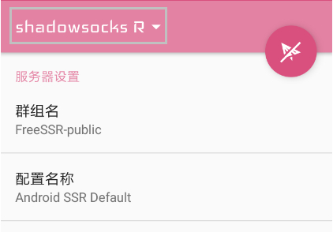

3.划动删除默认节点配置；

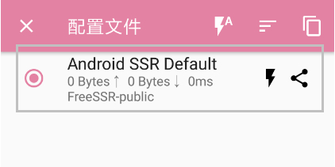

4.点击右下角 “+”，选择 “添加/升级 SSR 订阅”；

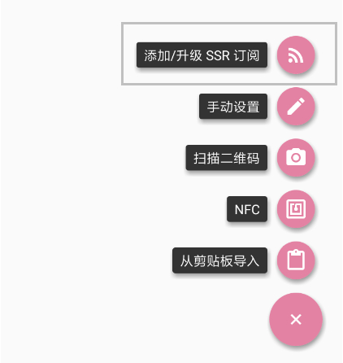

5.划动删除默认订阅链接；

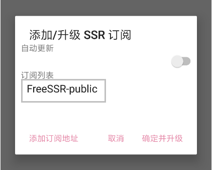

6.选择 “直接删除”；

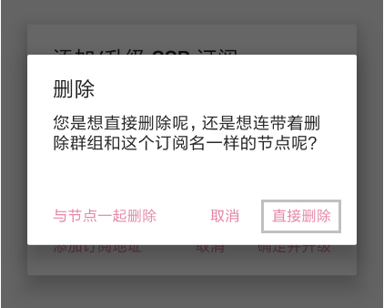

7.点击 “添加订阅地址”；

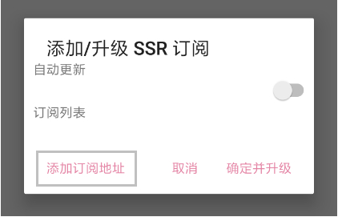

8.粘贴节点订阅链接，点击 “确定”；

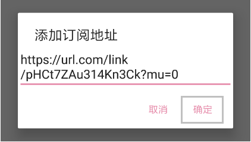

9.打开自动更新，点击「确定并升级」。

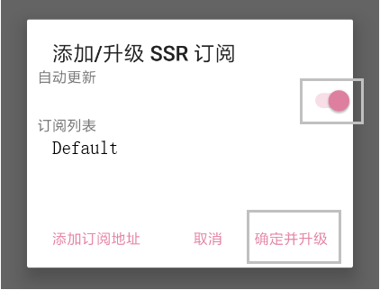

## 选择节点

1.在节点列表中，点击闪电图标检测节点延迟，选择一个可用节点。

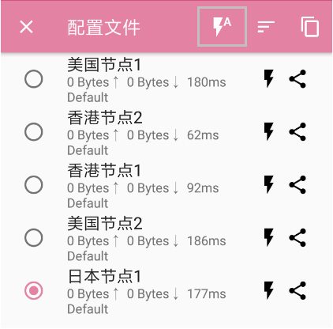

## 启动代理

1.点击右上角小飞机图标启动代理；

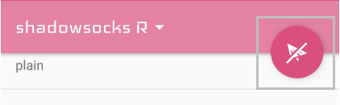

2.首次启动会弹出一个 “网络连接请求”，点击 “确定” 即可。

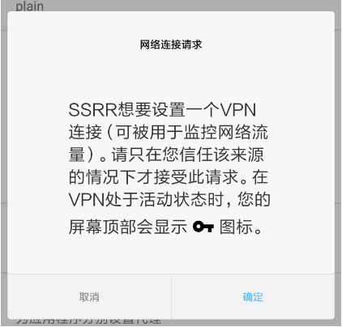

注：如果需要全网代理，下划找到 “路由”列表，切换为 “全局”。