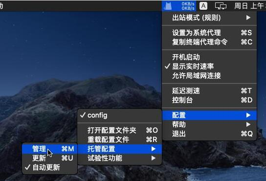
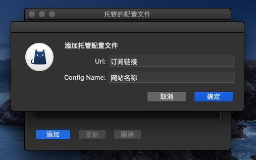
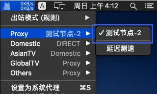
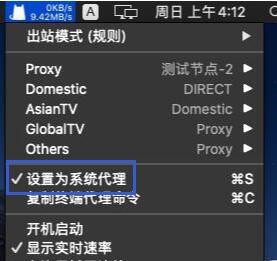

# ClashX Pro

## 下载程序

下载地址：https://install.appcenter.ms/users/clashx/apps/clashx-pro/distribution_groups/public

## 导入节点

1.复制订阅链接；

[cinwell website](/sublink?type=clashr ':include :type=markdown')

2.选择「配置》托管配置》管理」；

3.粘贴订阅链接并填写网站名称；

4.点击确定后提示 “重载配置文件成功”；

5.列表中选择一个节点；

6.最后设置为系统代理。

