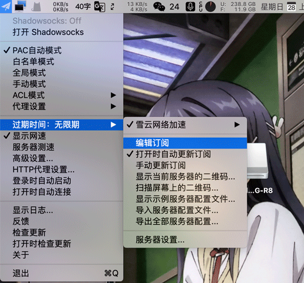
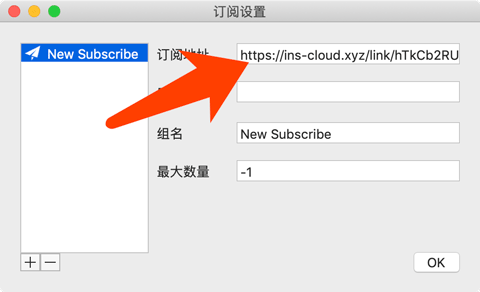
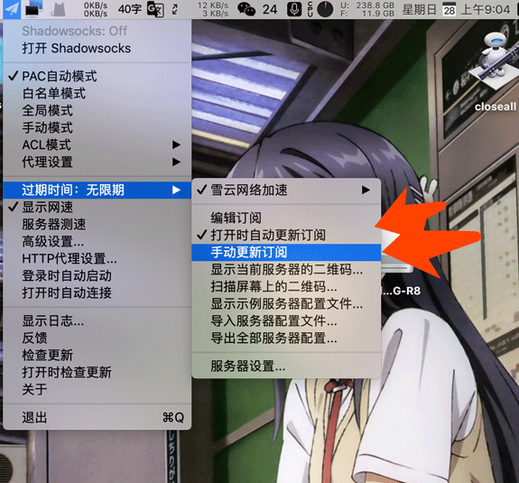
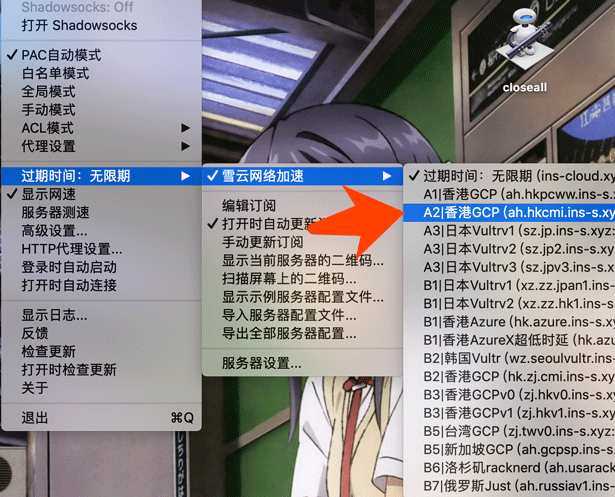

# ShadowsocksX

# 下载程序

在用户中心快速配置处点击下载

https://xueyun.club/ssr-download/ShadowsocksX-NG-R8.dmg

# 配置开始

1.复制订阅链接；

[cinwell website](/sublink?type=ssr ':include :type=markdown')

2.复制订阅链接↑，下载完成，运行 ShadowsocksX-NG-R8，点击任务栏托盘图标、点击编辑订阅；

3.将复制的订阅填入「订阅地址」内，并点击ok保存；

4.再次点击任务栏纸飞机图标，选择此处的更新手动订阅，并将打开时自动更新勾勾打上；

5.更新订阅完毕后即会有节点出现，再选中需要连接的线路；

6.推荐选择PAC模式，再单击打开Shadowsocks；

7.即科学上网成功；

