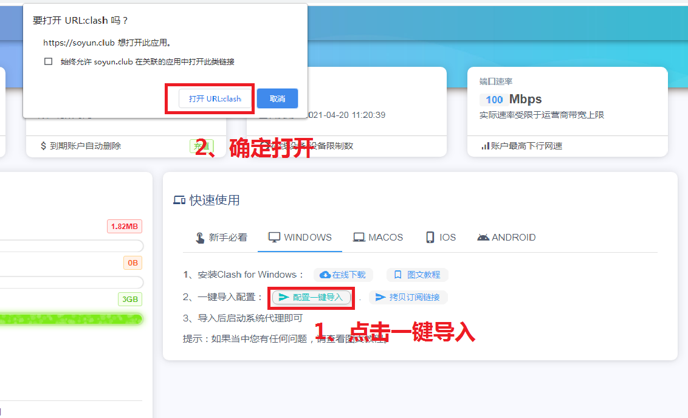
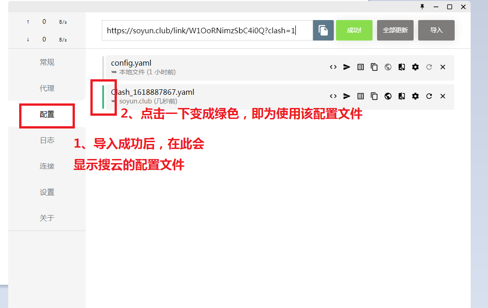

# Clash for windows

## 下载程序

程序下载：https://sabrinathings.lanzous.com/iJFGQm7l21i

## 导入节点

1.下载CLash for windows;

2.解压并运行 CLash for windows.exe；

3.打开主界面后，到网站点击一键导入；

3.1 一键导入.点击打开

4.查看配置；

## 节点&模式选择

5.节点模式选择。

推荐模式：规则

本站已针对标准需要代理的地址进行的分流；
如果你不懂分流配置，可无需修改，直接选择第一行的需要连接的节点，进行下一步即可；

## 启动代理

1.打开主控台的系统代理按钮。

1.2也可鼠标右键托盘小猫咪图标-选择-系统代理

关闭连接也是一样，再点一下就是关闭；
