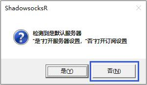
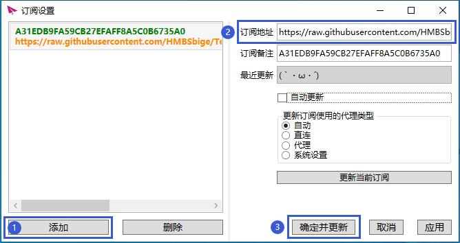
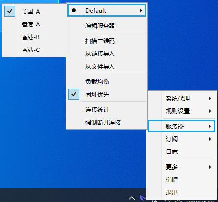
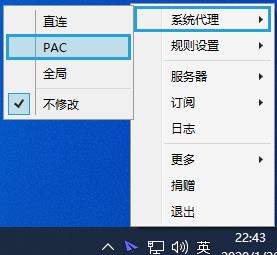

# ShadowsocksR

## 下载程序

程序下载：https://github.com/HMBSbige/ShadowsocksR-Windows/releases/download/5.2.3/ShadowsocksR-Win64-5.2.3.7z

## 导入节点

1.解压并运行 ShadowsocksR.exe;

2.弹出如图提示，选择 “否” ；

3.复制订阅链接；

[cinwell website](/sublink?type=ssr ':include :type=markdown')

4.点击 “添加”，然后在 “订阅地址” 处替换订阅链接，最后点击 “确定并更新”。

## 切换节点

1.鼠标右键托盘小飞机图标，选择「服务器》网站名称」里任意节点。

## 启动代理

1.鼠标右键托盘小飞机图标，选择「系统代理》PAC」即可自动代理网站。

注：如果需要全网代理，选择「系统代理》全局」即可。