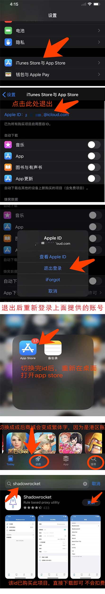
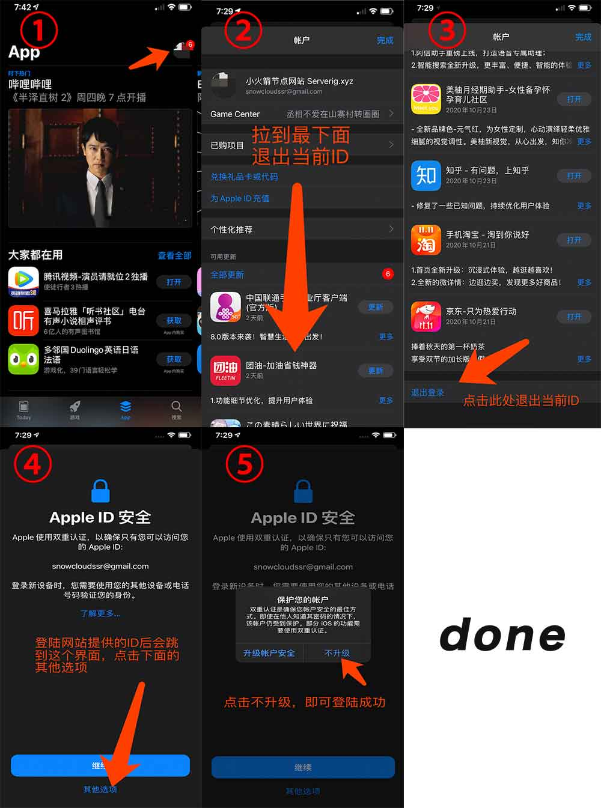
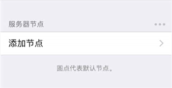
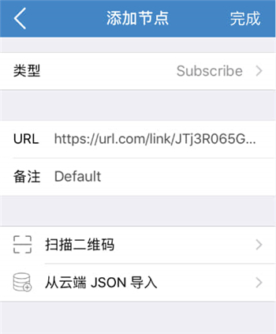
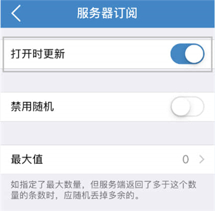
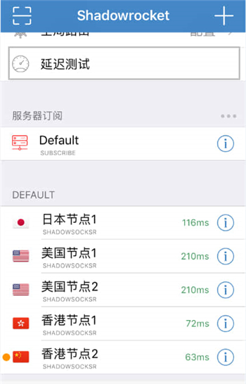
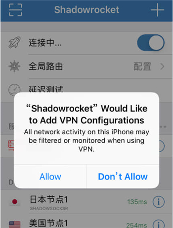

# Shadowrocket

## 下载程序

用户中心的快速配置里获取 App Store 账号密码。

操作方法：打开设置→'iTunes Store与App Stor' → 登陆此id，登陆后自动重新打开app store将会跳转到香港商城 如无法登陆账号(提示被账号锁定，请提交工单，我们会第一时间跟进处理

下载完请切换回自己的id，切勿登陆icloud，仅提供app store下载使用。(免费共享id,请珍惜。避免不了有不怀好意之人，登陆icloud可能会导致手机被锁or进入丢失模式，)
  登陆app store 权限仅限于商城，是不会对手机有控制权限的，请放心享用外区app

## ios14下载方式(ios10-ios13参考上面

## 导入节点

1.复制订阅链接；

[cinwell website](/sublink?type=shadowrocket ':include :type=markdown')

2.打开 Shadowrocket，点击 “添加节点”； 

3.类型选择 “Subscribe”，粘贴订阅链接至 “URL” 中，并填写好 “备注”，点击右上角 “完成”；

## 开启自动更新订阅

1.点击右下角 “设置”，找到并点击 “服务器订阅”；

2.开启 “打开时更新“ 选项。

## 选择节点

1.返回到首页，点击 “延迟测试”，然后选择一个可用节点。

## 启动代理

1.首次启动会提示 “Shadowrocket 想要添加 VPN 配置”，点击 “Allow” 验证密码即可。

